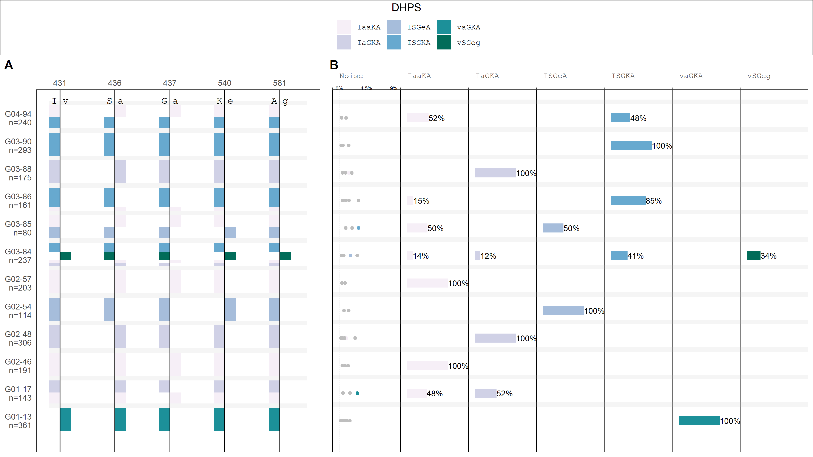

# PHARE

```
            *           /
  \         |         /
    \      / \      /
      \  /_____\  /
      /  |. | ||  \
    /  |_|:_|_||_|  \
  /     \.      /     \
         |;:   |        \
         |;:.  |          
         |;:  .|
         |;: . | 
         |;:   |            
         |;: , |-~^~ ~^             . -~^~ ~^~ -^~                        
^ -~^~  _|;:  _|\_      -~^~ ~^~ -^~    
 ^    /^    .| |. |-_              ^          ~
     |    ^     ^    |   ~              -
  ~  |       *   |   \-          ~             .
     ===-'-.~~'-~.~-'""~ 


```

# Finding _**P**. falciparum_ **ha**plotypes with **re**sistance mutations in polyclonal infections

A fast and simple pipeline to detect haplotypes in Oxford Nanopore MinION data from multiclonal samples.




## Requirements:
- A conda installation is required to run the pipeline.

## Usage:
### 1. Create and activate the conda environment
- `conda env create -n phare --file worflow/envs/phare.yml`
- `conda activate phare`


### 2. Get the following files ready:
Examples for these files can be found in the resources folder

- jsonl file from genbank gene browser (click on Download Dataset and use both the jsonl file as well as the fna)
- fasta file with the whole gene (downloaded togethere with jsonl)

### 3. Adjust the Configuration

- Add a sample_list.xlsx file to the config folder. Two columns are required: 
    * "barcode": a number representing the barcode used for ONT sequening
    * "sample": a sample name to be displayed in the plot

- Add a configuration for each gene you want to analyze with the following parameters:
    * gene_name: the name of the gene or contig which is analyzed.
    * minqual: the minimum quality of reads and nucleotides. This depends on your dataset.
        + For a dataset with a low coverage, a lower quality score should be used. It also depends on the number of reads retained after running the pipeline. 
        + The lower minimum quality should then be compensated by an increased threshold in the subsequent analysis in R
    * targetlen: the length of the amplicon which was sequenced
    * minlen: the minimum length of reads to be considered for the pipeline (default: targetlen + 250)
    * maxlen: the maximum length of reads to be considered for the pipeline (default: targetlen - 50)
    * generef: path to the previously created .fasta file in resources
    * genebank_ref: path to the previously created .jsonl file in resources
    * contig: reference name/contig. This needs to be ***exactely the same as the heading of the fasta file***
    


### 4. Copy Nanopore read data and execute the Snakemake pipeline
- Copy your reads into data/samples or create a symbolic link to them in the folder where they are stored. The pipeline expects one .fastq file for each sample.
- Navigate to the root directory of the pipeline and run snakemake: `snakemake --cores all`


<!-- 
See the comments in the R file for details about all paramterers
Most importantly though, a threshold has to be set to differentiate between noise and real haplotypes. It is the minimum fraction of reads as part of all reads in a sample that have to be of a certain haplotype, for this haplotype to be considered not noise. (noise = sequencing errors)

The R script consists of the following functions:

- a function to do the initial setup. all variables are stored in a list for easy access (and to simulate a kind of class like structure)
- a function to read all files in a path
    * the barcode number is inferred from the file name! it assumes one to three numbers in the file name: first, the barcode/source, then the subset and lastly the replicate number for in silico replicates
- a function to join the sample names to the data frame and calculate the total number of reads
- a function to create snp/roi dataframe and a reference sequence
    + gb_report: a reportfile downloaded from genbank in .json format, which corresponds to the reference sequence. it is used to calculate exon and intron positions.
    + hapl: the dataframe with all the snps => used to create the output df
- filter duplicate snps
    + if we have a duplicate snp (same aa position but different nucleotide)
- translate nucleotide snps to amino acids
- calculate the frequency of the aa variants
- apply a treshold and then recalculate haplotypes and their relative frequencies for all the haplotypes which still exist (are not considered noise)
- make the dataframe necessary for the plot
- create a plot
- store a plot -->