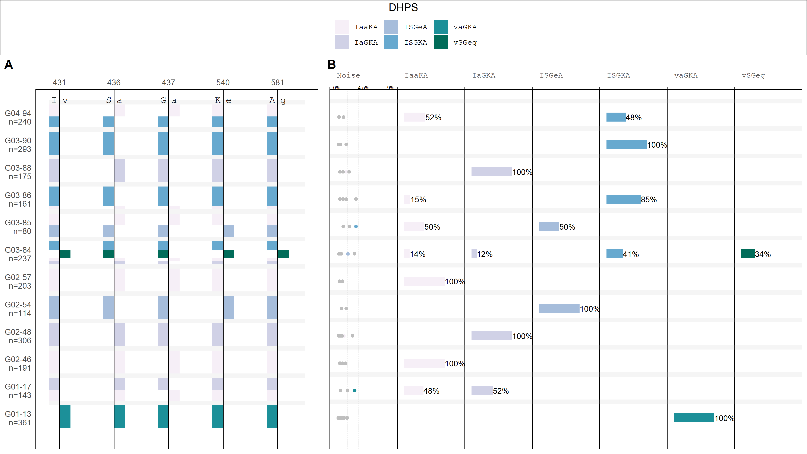

# PHARE

```
            +             /
\           |           /
  \         |         /
    \      / \      /
      \  /_____\  /
      /  |__|__|  \
    /  |;|     |;|  \
  /    \\.    .  /    \
/       ||:  .  |       \
        ||:     |         \
        ||:.    |           \
        ||:    .|
        ||:   , |         /`\
        ||:     |                                          /`\
        ||: _ . |                             /`\
       _||_| |__|                      ____
  ____~    |_|  |___           __-----~    ~`---,__             ___
-~                  ~---___,--~'                  ~~----_____-~'
`~----,____                      -Niall-


from: https://www.asciiart.eu/buildings-and-places/lighthouses

```

# Finding _**P**. falciparum_ **ha**plotypes with **re**sistance mutations in polyclonal infections

A fast and simple pipeline to detect haplotypes in Oxford Nanopore MinION data from multiclonal samples.




## Requirements:
- artic-pipeline: https://artic.readthedocs.io/en/latest/
  can be installed using conda/mamba: mamba install -c bioconda -c conda-forge artic
- SeekDeep: https://github.com/bailey-lab/SeekDeep
- Python 3 (tested using version 3.8.13)

## Usage:
### 1. Get the following files ready:
Examples for these files can be found in the templates folder

- primer file (as required by SeekDeep):
  + first line (header) should read: target forward reverse
  + second line should read: target/gene_name forward_primer reverse_primer
- jsonl file from genbank gene browser (click on Download Dataset and use both the jsonl file as well as the fna)
- fasta file with the whole gene (see above)


### 2. Prepare the execution script
Adapt the haplotypes.slurm file to your needs. The following needs to be adapted:

- variables
    * gene: the name of the gene or contig which is analyzed. ***needs to be the same as the "target" in the primer file***
    * contig: reference name/contig. This needs to be ***exactely the same as the heading of the fasta file***
    * minlen: the minimum length of reads to be considered for the pipeline
    * maxlen: the maximum length of reads to be considered for the pipeline
    * source: the source directory as produced by guppy. A directory with folders like barcode01 etc. containing .fastq is expected.
        + when working with fastq.gz files a small change in the haplotypes.sh script needs to be done
    * minqual: the minimum quality of reads and nucleotides. This depends on your dataset.
        + For a dataset with a low coverage, a lower quality score should be used. It also depends on the number of reads retained after running the pipeline. 
        + The lower minimum quality should then be compensated by an increased threshold in the subsequent analysis in R
- write the barcodes that you are going to use in the loop
- check that the haplotype.sh and variance_calc.py calls use your files

### 3. Execute the script
Execution needs the artic environment loaded and SeekDeep in Path

### 4. Use the included R script to analyze the Result
The script need the following files:

- samples: An excel file with the Barcodes and the corresponding Sample names
- gb_report: the jsonl file used previously
- fasta_ref: the fasta file used previously

See the comments in the R file for details about all paramterers
Most importantly though, a threshold has to be set to differentiate between noise and real haplotypes. It is the minimum fraction of reads as part of all reads in a sample that have to be of a certain haplotype, for this haplotype to be considered not noise. (noise = sequencing errors)

The R script consists of the following functions:

- a function to do the initial setup. all variables are stored in a list for easy access (and to simulate a kind of class like structure)
- a function to read all files in a path
    * the barcode number is inferred from the file name!<!-- * it assumes one to three numbers in the file name: first, the barcode/source, then the subset and lastly the replicate number for in silico replicates -->
- a function to join the sample names to the data frame and calculate the total number of reads
- a function to create snp/roi dataframe and a reference sequence
    + gb_report: a reportfile downloaded from genbank in .json format, which corresponds to the reference sequence. it is used to calculate exon and intron positions.
    + hapl: the dataframe with all the snps => used to create the output df
- filter duplicate snps
    + if we have a duplicate snp (same aa position but different nucleotide)
- translate nucleotide snps to amino acids
- calculate the frequency of the aa variants
- apply a treshold and then recalculate haplotypes and their relative frequencies for all the haplotypes which still exist (are not considered noise)
- make the dataframe necessary for the plot
- create a plot
- store a plot